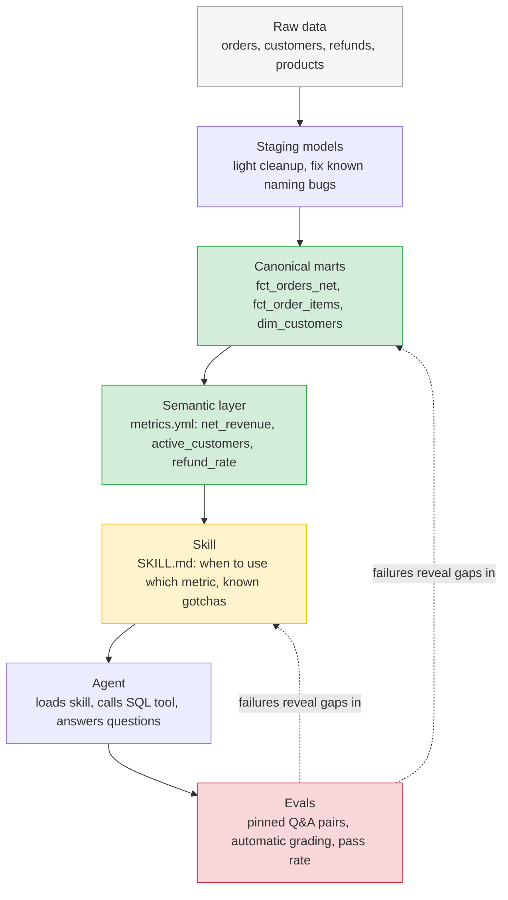
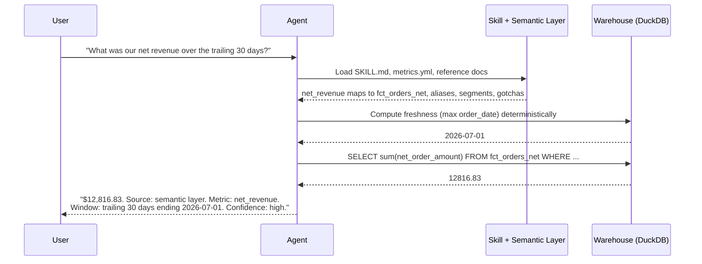
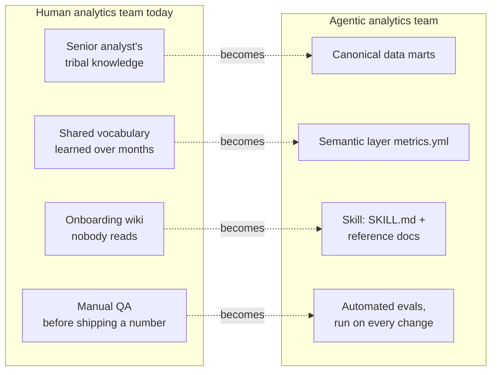

# Self-Serve Analytics Agent: A Working Model for Agentic Analytics

## WHY: The Objective

Every analytics organization faces the same bottleneck: business questions
outnumber analyst hours. The instinct is to point an AI model at the data
warehouse and let it answer questions directly. That instinct fails in a
specific, predictable way: a model with no shared context about what
"revenue" means, which tables are governed, or what data quirks exist will
give confident, wrong answers just as often as right ones.

Anthropic's article, [How Anthropic enables self-service data analytics
with Claude](https://claude.com/blog/how-anthropic-enables-self-service-data-analytics-with-claude),
makes the case that this is not a model capability problem. It is a
context and validation problem, solved with four layers: governed data
foundations, a semantic layer, procedural "skills," and offline evals with
provenance tracking.

This project builds a small, complete version of that same stack, using
synthetic e-commerce data, so the pattern can be learned, tested, and
broken on purpose before being trusted with anything real. The objective
was never just to get a number back from an AI agent. It was to prove out
the operating model that makes that number trustworthy at scale.

---

## WHAT: The Project, in Four Layers



| Layer | What it does | Where it lives |
|---|---|---|
| **Data foundations** | Raw, messy data cleaned once and modeled into governed, canonical views | `warehouse/models/staging` and `warehouse/models/marts` |
| **Semantic layer** | Business terms like "net revenue" and "active customers" defined exactly once | `warehouse/semantic_layer/metrics.yml` |
| **Skill** | Procedural instructions telling an agent how to use the above, including known data gotchas | `skills/ecommerce-analytics/` |
| **Validation** | A pinned set of test questions with known-correct answers, run automatically against the agent | `evals/eval_set.json`, `evals/run_evals.py` |

The data itself contains real, intentional messiness: a product that was
renamed mid-history, disposable-email signups that should not count as
real customers, an unaggregated refunds table that is easy to double-count
from. None of that is decorative. It exists because production warehouses
look exactly like this, and the point of the project is to prove the
architecture holds up against it, not against a clean toy dataset.

The agent itself was built and tested against a free model
(NVIDIA Build's hosted Mistral Nemotron), deliberately, before ever
touching a paid API. That choice turned out to matter more than expected.
See "What If" below.

### What actually happens when someone asks a question



The freshness date is computed in code, not asked of the model, because
the model repeatedly fabricated a plausible-looking date instead of
checking the real one, even when explicitly instructed not to. That single
design change is discussed further under "What If."

---

## HOW: This Is the Blueprint for an Agentic Analytics Team

The four layers above are not just a technical pattern. They map directly
onto how a human analytics team already works, which is what makes this
approach organizationally scalable rather than just a clever demo:



- **Data foundations are the team's shared source of truth.** Today, that
  knowledge often lives in a senior analyst's head, or scattered across
  Slack threads and tribal memory about "which table is actually right."
  Encoding it as governed marts turns tribal knowledge into an asset
  anyone, human or agent, can build on.

- **The semantic layer is the team's shared vocabulary.** New analysts
  spend their first weeks learning what "revenue" means at this specific
  company. An agent can absorb that vocabulary in one context load, and
  more importantly, it cannot silently drift from it the way a large,
  loosely governed dbt project can over time.

- **Skills are onboarding documents that actually get read.** Every team
  has a wiki page of gotchas nobody checks before running a query. A skill
  is that same knowledge, but structured so it is loaded automatically,
  every time, as a precondition for acting, not a nice-to-have reference.

- **Evals are the team's QA function.** No analytics team ships a new
  dashboard without someone checking the numbers against a known-good
  source. Evals do that same check, automatically, on every change to the
  skill or the warehouse, which is the difference between "we think the
  agent is accurate" and "we can show it is."

The strategic implication: building an agentic analytics function is not
primarily a model-selection exercise. It is an information-architecture
exercise the organization already knows how to do for human teams, applied
with the same discipline to an AI one. Any team with a real data warehouse
and the willingness to write down what it already knows can build this.

---

## WHAT IF: Learnings and Strategic Next Steps

### Learnings

**1. Model choice is a real, separate variable from architecture quality.**
Testing against a free model surfaced failure modes that a well-designed
skill and semantic layer did not, by themselves, prevent: the model wrote
SQL as prose instead of calling the tool, fabricated a plausible-looking
"data freshness" date instead of querying for the real one even when
explicitly told not to, and occasionally produced garbled, unstable
output under load. Good architecture reduces the space for error. It does
not replace the need for a capable, reliable model underneath it.

**2. Some failure modes need to be solved in code, not in prompts.**
Repeated instructions not to fabricate the data's freshness date did not
reliably stop the model from doing it. The fix that actually worked was
architectural: compute the true value once, in code, and hand it to the
model as a stated fact rather than asking it to remember to look it up.
The strategic lesson generalizes: for any fact where being wrong is
costly, do not rely on instruction-following alone. Make it structurally
impossible to get wrong.

**3. Evals must be adversarially reviewed, not just run.**
An early version of this project's own automated grader rubber-stamped an
answer that contained no actual number at all, and separately, contradicted
its own stated grading rule in its own reasoning text. A grading system
built from the same class of model being graded inherits some of the same
unreliability. Leaders should treat a passing eval score as a claim to be
audited on a sample, not a fact to be trusted at face value, especially
early in a program's life.

**4. Free tier infrastructure has no uptime guarantee, and that is fine
for a pilot but not a decision criterion for production.** Transient
errors, timeouts, and rate limits were a real, recurring part of testing.
That is an acceptable cost during a proof-of-concept phase run at zero
marginal cost. It is not a foundation to build a customer-facing or
revenue-reporting system on.

**5. If a model narrates its own provenance, it will eventually fabricate
some of it.** The freshness-guessing bug kept resurfacing even after being
explicitly instructed away. The fix that actually held: stop asking the
model to describe what it did, and build the provenance footer in code
from the real execution trace of every query it ran. A footer generated
this way cannot lie, because it is not a memory, it is a log.

**6. A grader should check for a fact before it judges an opinion.**
Splitting grading into a programmatic check (does a `FINAL_ANSWER` line
exist, does the number match within tolerance) and an LLM check (reserved
only for genuinely judgment-based questions) cut LLM grading calls roughly
in half and closed the exact false-pass hole that let an answer with no
real number in it get marked correct earlier in this project.

**7. Evals catch inconsistencies a human reviewer would miss on a skim.**
One eval failed because the model used `>=` instead of `>` on a single
date boundary, in an otherwise-correct query, on one question out of
eight. That one-character inconsistency was invisible in a quick read of
the SQL and only showed up because a pinned, tolerance-checked expected
value caught the resulting drift.

**8. The same class of bug will find every tool in your stack, not just
the agent.** Standing up a free BI tool (Metabase) against this same
warehouse surfaced two more real integration problems before a single
dashboard could be built: the official Metabase Docker image is
Alpine-based and structurally incompatible with DuckDB's native driver
(a documented, maintainer-acknowledged issue, fixed by switching to a
community-provided Debian-based image instead), and a read-only volume
mount blocked DuckDB from opening the file at all, since even read
queries need incidental write access for lock files. Once connected, the
very first dashboard number came back wrong, **$13,333.33 instead of
$12,816.83**, because Metabase's own visual date-range picker is
inclusive on both bounds, silently including one extra day. The same
`>=` versus `>` boundary bug that broke one eval question had now broken
a BI tool's GUI too, independently, in a completely different system.
The fix was the same lesson from a different angle: don't trust a visual
filter's implicit semantics, write the exact governed SQL directly.

### Strategic Next Steps

1. **Run the same pinned eval set against a frontier model (Claude) and
   compare pass rates directly.** This project's architecture is model
   agnostic by design. The comparison itself becomes a data-backed
   business case for what tier of model a given use case actually
   requires, rather than a default assumption in either direction.

2. **Treat the semantic layer as a living, owned artifact, not a
   one-time setup task.** In a real organization, `metrics.yml` should
   have a named owner, a review process for changes, and version history,
   the same way a data contract or an API schema would.

3. **Expand the skill library one domain at a time, and eval each one
   before combining them.** The pattern here covers one domain (orders and
   customers). Scaling to marketing, finance, or product analytics means
   adding skills incrementally, with dedicated eval coverage per domain,
   not one large skill covering everything at once.

4. **Put a human in the loop gate in front of any high-stakes or
   externally visible output**, at least until a domain's eval pass rate
   and provenance accuracy have been tracked over enough volume to earn
   trust. The provenance footer pattern in this project exists precisely
   so that gate has something concrete to check against.

5. **Build the eval suite before scaling usage, not after.** The most
   valuable artifact in this project was not the agent. It was the
   pinned eval set that made the agent's real failure modes visible,
   specific, and fixable. Any team adopting this pattern should treat
   eval set construction as the first deliverable, not the last.

---

## Repository Structure

```
data/                          synthetic raw data generator
warehouse/
  models/staging/               light cleanup views over raw tables
  models/marts/                 canonical, governed models
  semantic_layer/metrics.yml     single source of truth for business terms
skills/ecommerce-analytics/     agent instructions and reference docs
dbt_analytics/                  dbt-core project: schema tests plus the Comet Mug regression test
agent/                         the working agent (NVIDIA free tier by default)
evals/                         pinned test questions, grader, results log, summarize_results.py
docs/                          milestone by milestone build guide
```

See `docs/` for the full step by step build process this project was
constructed through, including the real debugging history behind the
learnings above.